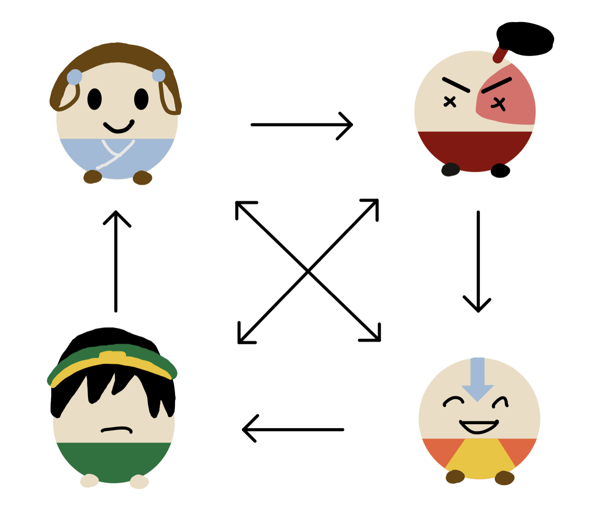
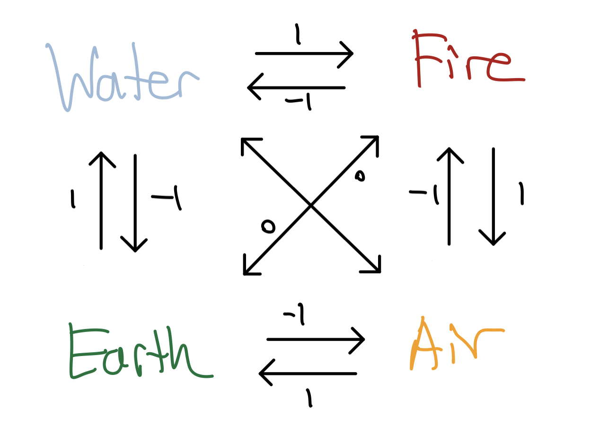

# Regret Minimization and Avatar the Last Airbender

## Aang vs Baang

Earth, Fire, Water, Air. Long ago, the four nations lived in peace and harmony. Thanks to the Avatar Aang, the master of all four elements, conflicts were mitigated and resolutions were devised.

But it all changed one day... there was a sudden tear in the very fabric of our reality: an anti-Avatar appeared! He too had mastered all four elements. However, the anti-Avatar Bang seeked to wreak havoc and destroy the peace Aang had built.

War ravaged on as Bang laid waste onto the world. It all culminated into a final fight between Aang and Bang.

How might we model this fight? Let's use game theory to model this fight as a **two-player zero sum game**.

## Game Theory

Game theory studies situations that involves decision making amongst multiples rational parties or people. Suppose the the fight between Aang and Bang is represented as a game, where either Avatar must select what element they wish to use to attack the other. If this sounds similar to rock, paper, and scissors (RPS), then you've got the right idea.

Before we talk about game theory, let's first define the way in which the four elements dominate one another. _There's nothing formal about this, but we'll just use this intuition to help us define a clear hierarchy._

### Elemental Hierarchy

<span>


</span>

Similarly to how in RPS, rock beats scissors, scissors beats paper, and paper beats rock, we establish an elemental ordering for our game. Namely Earth beats Water, Water beats Fire, Fire beats Air, and Air beats Earth. Unlike RPS, we also introduce a notion of "draws", where Water and Air tie with each other, as do Earth and Fire. To simplify things, we do not permit self loops (elements tie with themselves).

I will now go on to define some terms needed to understand Algorithmic Game Theory. If you are comfortable, feel free to skip the nested bullet points and just read the main ones. The nested bullet points serve to provide more in depth explanations, examples, and metaphors to help with understanding.

### Definitions

We will be referring to the following definitions and notations when talking about a **normal-form game (N, A, u)**.

- **N** is a finite set of _n_ players in our game.
  - In our scenario, _n=2_, since Aang is facing Bang.
- **A** is the set of all possible combinations of actions our players can take.
  - So if player _i_ has a set of actions _S_i_, then _A = S_1 x ... x S_n_, or the cross product each player's actions.
  - Each combination is referred to as an **action profile**.
  - In our game, Aang and Baang have identical actions. So for a set _S = {Earth, Water, Fire, Air}_, our game defines _A = S x S_ for our two players.
  - It follows that an example action profile for our game is some tuple of elements, such as _(Earth, Fire)_, or _(Water, Air)_, representing the actions that (Aang, Bang) choose respectively.
- **u** is a function mapping each action profile to a vector of utilities for each player.
  - We often refer to _u_i_ as a player's **payoff**.
  - For our game, the following `SML` function represents what our utility is. This is the exact same thing as the **Elemental Hierarchy** images, just written out more formally to help us better understand the game theory interpretation.

```sml
  datatype action = Earth | Water | Fire | Air
  type actionProfile = action * action

  fun utility ((Water, Fire)  : actionProfile) : int = 1
    | utility ((Fire,  Water) : actionProfile) : int = ~1
    | utility ((Water, Water) : actionProfile) : int = 0
    | utility ((Fire,  Fire)  : actionProfile) : int = 0
    | ...
    | ...
    | ...
    | utility ((Air,   Earth) : actionProfile) : int = 1

```

Writing out every action profile and mapping it to a certain utility gets redundant, so a common representation of a utility function, as well as just normal-form games is a table. This is usually for two player games with smaller action profiles, as it can get more complicated with larger action profiles and more players.

|           | Earth  | Water  | Fire   | Air    |
| --------- | ------ | ------ | ------ | ------ |
| **Earth** | (0,0)  | (1,-1) | (0,0)  | (-1,1) |
| **Fire**  | (0,0)  | (-1,1) | (0,0)  | (1,-1) |
| **Water** | (-1,1) | (0,0)  | (1,-1) | (0,0)  |
| **Air**   | (1,-1) | (0,0)  | (-1,1) | (0,0)  |

> So if the above table represents our normal-form game, we might say that the row's represent Aang's choices, and the column's Bang's choices. For example, if Aang uses an Air attack and Bang uses and Earth attack, we go to the Air row and Earth column. In other words, at (Air, Earth), we see that our utility is the tuple (1,-1). Meaning Aang has a positive utility and Bang has a negative utility. This follows with our intuition since (according to our elemental hierarchy), Air beats Earth!

### Pure vs Mixed Strategies

Now that we've set the stage for talking about the final battle between Aang and Bang within the context of Game Theory, as well as it's accompanying mathematical definitions, let's discuss more about the strategies either avatar will employ to defeat one another.

In game theory, there are two kinds of strategies:

- **Pure Strategy** is if a player always chooses a single action.

  - In other words, a player _i_ will pick an action _s \in S \_i_ with probability
  - If we model a fight between and Avatar Aang and Zuko, the Avatar will always pick a Water attack, since Zuko is a firebender.
    - Consider _S\_\{Avatar} = {Earth, Fire, Water, Air}_ and _S\_\{Zuko} = {Fire}_
    - Since Zuko can only attack with Fire... `utility(Water, Fire) = 1`, which is the largest utility for all other actions of Avatar Aang
    - Aang will always pick water to defeat Zuko
  - We can represent this as a tuple `(0, 1, 0, 0)`, representing the probability that Aang selects each element to attack with.

- **Mixed Strategy** is if a player chooses between at least two actions with varying probabilities.
  - In other words, a player _i_ will pick an action _s \in S \_i_ with probability
  - If we model a fight between and Avatar Aang and Zutara (a mixed water/fire bender), the Avatar will either pick Earth or Water.
    - Consider _S\_\{Avatar} = {Earth, Fire, Water, Air}_ and _S\_\{Zutara} = {Water, Fire}_
    - If Zutara attacks with Water... `utility(Earth, Water) = 1`
    - If Zutara attacks with Fire... `utility(Water, Fire) = 1`
    - Aang maximizes his utility by attacking with either Earth or Water
  - We can represent this as a tuple `(0.5, 0.5, 0, 0)`, representing the probability that Aang selects each element to attack with.

### Notation

When talking about strategies, I will use the symbol **σ**.

- **Tuple Notation** is something I will be using as shorthand for certain strategies.

  - For example, for a pure strategy against Zuko, Aang can employ the strategy `σ = (0,1,0,0)`
  - The index of the tuple represents the action chosen, namely `(Earth, Water, Fire, Air)`
  - As such the above tuple, as described in the **pure strategy** section, represents that Aang chooses `Water` with probability 1, and the other elements with probability 0.

- **Function Definition** is a more formal version of how one might describe strategies, especially when actions get too long to list.
  - For example _σ_i(s)_ is the probability player _i_ selects action _s_.
  - Similar to our utility function, this is what a certain strategy might look like as an `SML` function.
  - This function represents the strategy Aang uses against Zutara in the **mixed strategy** explanation.

```sml
datatype action = Earth | Water | Fire | Air

fun mixedStrategyZutara(Earth  : action) : real = 0.5
  | mixedStrategyZutara(Water  : action) : real = 0.5
  | mixedStrategyZutara(Fire   : action) : real = 0.0
  | mixedStrategyZutara(Air    : action) : real = 0.0
```

With these strategies in mind, we have a few different ways to reason about their effectiveness.

- **Expected Utility** tells us what the utility is expected to be given the strategies of each player.

  - This is analogous to Expected Value in probability
  - For a given action profile, multiply the probability each player does their respective action with our utility from this action profile. We then want to sum this quantity across all action profiles.
  - Remember the types: `utility : actionProfile -> int` and `strategy : action -> real` where `actionProfile = action * action`.
  - For two player games, summing across all possible action profiles is the same as a double summation across either player's possible actions.
  - Formally, `ExpectedUtility(σ_A,σ_B) = Σ_{a = A's actions} Σ_{b = B's actions} σ_A(a) * σ_B(b) * u_A(a,b)`
  - Don't worry if the syntax is weird or if there are a lot of symbols. If you are comfortable with the core idea of expected utility, you are more than good to go!

- **Best Response** is a strategy for a certain player that maximizes their **expected utility** given all other player's strategies.

  - In the fight between Aang and Zuko (firebender from pure strategy example), to find the best response of Aang, we want to maximize his expected utility given all of Zuko's possible strategies.
  - Aang has a pure strategy of `σ = (0,1,0,0)` in this fight. This is also his best response, because relative to all of Zuko's possible strategies (which is just fire), we get the highest expected utility!
  - If Aang picks a strategy of `σ = (0,0,0,1)` in this fight, (always pick Air), he will always lose and have a negative expected utility. This is **NOT** a best response. However, it is still a valid response.

  > A core assumption in Game Theory is that all players are rational, meaning they will always pick the best option. So in this scenario, Aang would never pick Air when fighting against Zuko since he is rational. However, this isn't always the case as there could be scenarios where Aang doesn't act rationally (for example attacking the Fire Nation during Sozin's comet), or in this strategy when he uses Air against Fire. This demonstrates that in some scenarios, Game Theory falls short of our expectations.

- **Nash Equilibrium**

It's important to understand the above ideas about game theory, as well as their formal mathematical definitions before we move on to explore a particular way to reason about games: **Regret Minimization**.

## Code a website where you can test the algorithm on different inputs

## Case on form of elemental dominance, generalize to that
