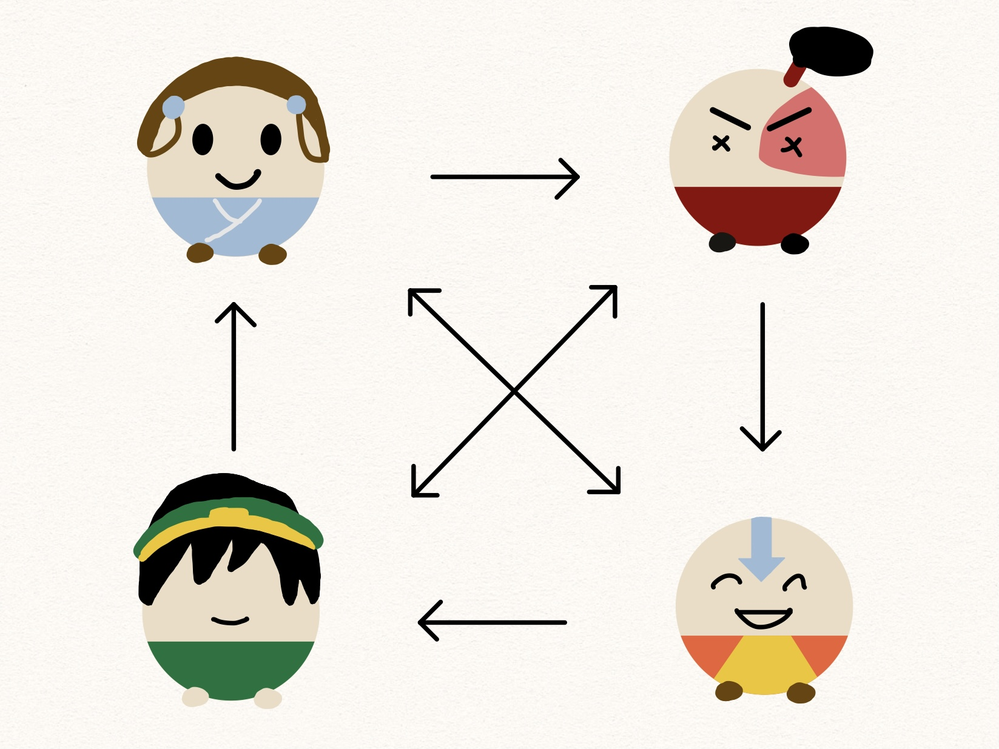
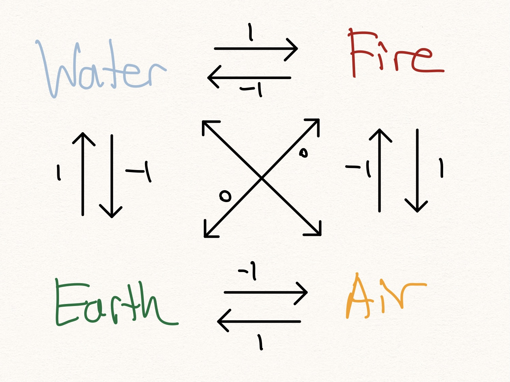

# Regret Minimization and Avatar the Last Airbender

## Aang vs Baang

Earth, Fire, Water, Air. Long ago, the four nations lived in peace and harmony. Thanks to the Avatar Aang, the master of all four elements, conflicts were mitigated and resolutions were devised.

But it all changed one day... there was a sudden tear in the very fabric of our reality: an anti-Avatar appeared! He too had mastered all four elements. However, the anti-Avatar Bang seeked to wreak havoc and destroy the peace Aang had built.

War ravaged on as Bang laid waste onto the world. It all culminated into a final fight between Aang and Bang.

How might we model this fight? Let's use game theory to model this fight as a **two-player zero sum game**.

## Game Theory

Game theory studies situations that involves decision making amongst multiples rational parties or people. Suppose the the fight between Aang and Bang is represented as a game, where either Avatar must select what element they wish to use to attack the other. If this sounds similar to rock, paper, and scissors (RPS), than you've got the right idea.

Before we talk about game theory, let's first define the way in which the four elements dominate one another. _There's nothing formal about this, but we'll just use this intuition to help us define a clear hierarchy._

Similarly to how in RPS, rock beats scissors, scissors beats paper, and paper beats rock, we establish an elemental ordering for our game. Namely Earth beats Water, Water beats Fire, Fire beats Air, and Air beats Earth. Unlike RPS, we also introduce a notion of "draws", where Water and Air tie with each other, as do Earth and Fire.

## Code a website where you can test the algorithm on different inputs

\(E=mc^2\)
